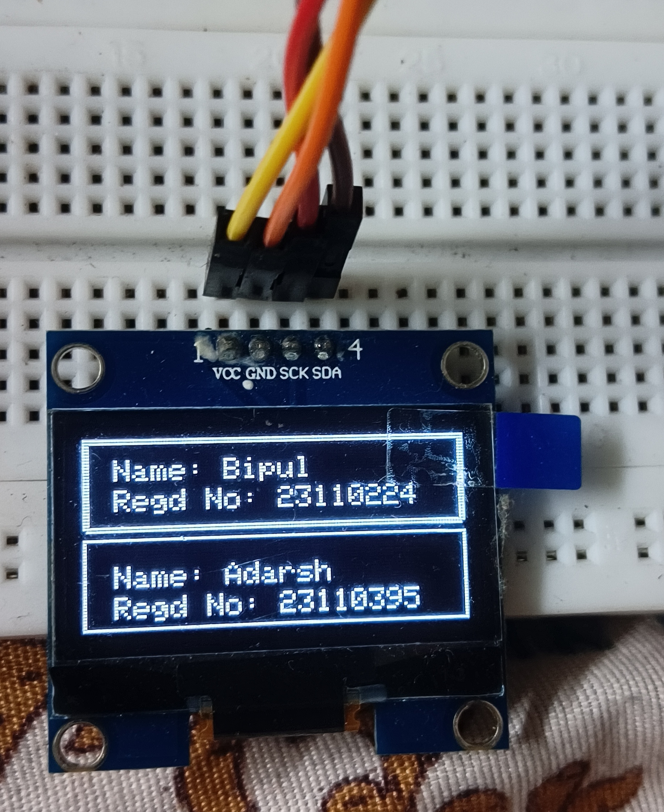

# 📝 ESP32 Student Management System

This project implements a basic student management system on an ESP32 microcontroller. It leverages SPIFFS (SPI Flash File System) for persistent data storage in JSON format and an SH1106 OLED display for user interaction. You can add, edit, and navigate student records by sending commands via the Serial Monitor.

---

## ✨ Features

* **Persistent Data Storage:** Student details (Registration Number, Name, GPA, Branch) are saved to a `students.json` file on the ESP32's flash memory, ensuring data isn't lost on power cycles.
* **OLED Display (SH1106):** A 128x64 SH1106 OLED provides a simple user interface, showing lists of students and detailed information for selected entries. It also displays system messages and errors.
* **Serial Monitor Interface:** Interact with the system by sending text commands from your Arduino IDE's Serial Monitor.
* **Command Set:**
    * `add <regdNo> <name> <gpa> <branch>`: Adds a new student record.
    * `edit <oldRegdNo> <newRegdNo> <newName> <newGPA> <newBranch>`: Modifies an existing student's details.
    * `up`/`down`: Navigates through the list of students on the OLED.
    * `ok`: Displays the full details of the currently selected student.
    * `back`: Returns to the student name list view from the full details screen.

---

## 💻 Hardware & Software Requirements

### Hardware
* **ESP32 Development Board** (any standard ESP32 board)
* **SH1106 OLED Display (128x64, I2C)**
    * Common I2C connections: **SDA** to ESP32 **GPIO 21**, **SCL** to ESP32 **GPIO 22**. (Verify pins for your specific board if different).

### Software
* **Arduino IDE**
* **ESP32 Boards Manager** (installed via Arduino IDE Preferences -> Additional Board Manager URLs)
* **Required Libraries:**
    * **`ArduinoJson`** by Benoit Blanchon (install via Arduino Library Manager)
    * **`Wire.h`** (standard Arduino I2C library, usually pre-installed)
    * **`FS.h`** and **`SPIFFS.h`** (ESP32 file system libraries, included with ESP32 core)
    * **`Adafruit SH1106`**: This project specifically uses a forked version of the Adafruit SH1106 library for compatibility.
        * **Please use this specific version:** [https://github.com/wonho-maker/Adafruit_SH1106/tree/master](https://github.com/wonho-maker/Adafruit_SH1106/tree/master)
        * **Installation:** Download the ZIP, then in Arduino IDE go to `Sketch > Include Library > Add .ZIP Library...`
        * You will also need the **`Adafruit GFX Library`** as a dependency (install via Library Manager).

---

## 📸 Visuals

To help with setup and understanding, consider including a **circuit diagram** showing how to connect the ESP32 to the SH1106 OLED display. Additionally, **OLED display images** (screenshots or photos of the actual OLED) demonstrating the student list view, full detail view, and various messages would greatly enhance this README. You can place these images within a dedicated `images/` folder in your repository and link to them here.

---

## 🚀 Getting Started

1.  **Prepare Arduino IDE:** Ensure you have the ESP32 board package installed.
2.  **Install Libraries:** Install `ArduinoJson` and `Adafruit GFX` through the Library Manager. Manually install the custom `Adafruit_SH1106` library from the provided GitHub link.
3.  **Upload Code:**
    * Open the project's `.ino` file in the Arduino IDE.
    * Select your **ESP32 Board** under `Tools > Board`.
    * Select the correct **COM Port** for your ESP32 under `Tools > Port`.
    * Click the **Upload** button to compile and flash the code to your ESP32.
4.  **Interact:**
    * After successful upload, open the **Serial Monitor** (`Tools > Serial Monitor`).
    * Set the baud rate to **115200**.
    * You can now send the commands listed in the "Features" section to manage your student data.

---

## 🧑‍💻 Author

* **Kritish Mohapatra**

---